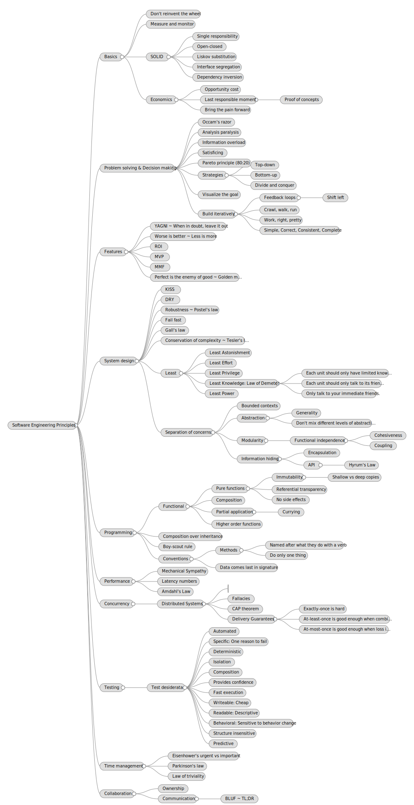

# Software Engineering Principles
Collection of software engineering concepts, principles, laws, practices, patterns and properties worth having present in the software engineer's practice.

## Basics
### Don't reinvent the wheel
### Measure and monitor
### SOLID
#### Single responsibility
#### Open-closed
#### Liskov substitution
#### Interface segregation
#### Dependency inversion
### Economics
#### Opportunity cost
Loss of potential gain from other alternatives when one particular alternative is chosen over the others.
_(from [Wikipedia](https://en.wikipedia.org/wiki/Opportunity_cost))_

#### Last responsible moment
##### Proof of concepts
#### Bring the pain forward

## Problem solving & Decision making
### Occam's razor
The simplest explanation is usually the right one. When presented with different solutions to the same problem, one should select the one with the fewest assumptions.
_(from [Wikipedia](https://en.wikipedia.org/wiki/Occam%27s_razor))_

### Analysis paralysis
Overthinking a situation can cause forward motion to become "paralyzed".
_(from [Wikipedia](https://en.wikipedia.org/wiki/Analysis_paralysis))_

### Information overload
Difficulty in understanding an issue and effectively making decisions when one has too much information about that issue.
_(from [Wikipedia](https://en.wikipedia.org/wiki/Information_overload))_

### Satisficing
Searching through the available alternatives until an acceptability threshold is met.
_(from [Wikipedia](https://en.wikipedia.org/wiki/Satisficing))_

### Pareto principle (80:20)
80% of consequences come from 20% of the causes (the “vital few”).
_(from [Wikipedia](https://en.wikipedia.org/wiki/Pareto_principle))_

### Strategies
#### Top-down
#### Bottom-up
#### Divide and conquer
### Visualize the goal
### Build iteratively
#### Feedback loops
##### Shift left
#### Crawl, walk, run
#### Work, right, pretty
#### Simple, Correct, Consistent, Complete

## Features
### YAGNI ~ When in doubt, leave it out
You aren't gonna need it.
Always implement things when you actually need them, never when you just foresee that you need them.
_(from [Wikipedia](https://en.wikipedia.org/wiki/You_aren%27t_gonna_need_it))_

### Worse is better ~ Less is more
Software quality does not necessarily increase with functionality. There is a point where less functionality is the preferable option.
_(from [Wikipedia](https://en.wikipedia.org/wiki/Worse_is_better))_

### ROI
### MVP
Minimum Viable Product.
Version of a product with just enough features to be usable by early customers who can then provide feedback for future product development.
_(from [Wikipedia](https://en.wikipedia.org/wiki/Minimum_viable_product))_

### MMF
Minimum Marketable Features.
ROI-informed approach to software development in which software is developed and delivered in carefully prioritized chunks of customer valued functionality.
_(from [Wikipedia](https://en.wikipedia.org/wiki/Incremental_funding_methodology))_

### Perfect is the enemy of good ~ Golden mean
Achieving absolute perfection may be impossible and so, as increasing effort results in diminishing returns, further activity becomes increasingly inefficient.
_(from [Wikipedia](https://en.wikipedia.org/wiki/Perfect_is_the_enemy_of_good))_

## System design
### KISS
Keep it simple, stupid.
Most systems work best if they are kept simple rather than made complicated; therefore, simplicity should be a key goal in design, and unnecessary complexity should be avoided.
_(from [Wikipedia](https://en.wikipedia.org/wiki/KISS_principle))_

### DRY
Don't repeat yourself.
Reduce repetition of software patterns, replacing it with abstractions or using data normalization to avoid redundancy.
_(from [Wikipedia](https://en.wikipedia.org/wiki/Don%27t_repeat_yourself))_

### Robustness ~ Postel's law
Be conservative in what you do, be liberal in what you accept from others.
_(from [Wikipedia](https://en.wikipedia.org/wiki/Robustness_principle))_

### Fail fast
Immediately report any condition that is likely to indicate a failure. Fail-fast systems are usually designed to stop normal operation rather than attempt to continue a possibly flawed process.
_(from [Wikipedia](https://en.wikipedia.org/wiki/Fail-fast))_

### Gall's law
A complex system that works is invariably found to have evolved from a simple system that worked. A complex system designed from scratch never works and cannot be patched up to make it work. You have to start over with a working simple system.
_(from [Wikipedia](https://en.wikipedia.org/wiki/John_Gall\_\(author\)#Gall's_law))_

### Conservation of complexity ~ Tesler's law
Every application has an inherent amount of complexity that cannot be removed or hidden. Instead, it must be dealt with, either in product development or in user interaction.
_(from [Wikipedia](https://en.wikipedia.org/wiki/Law_of_conservation_of_complexity))_

### Least
#### Least Astonishment
Applies to user interface and software design. It proposes that a component of a system should behave in a way that most users will expect it to behave. The behavior should not astonish or surprise users. The following is a formal statement of the principle: "If a necessary feature has a high astonishment factor, it may be necessary to redesign the feature."
_(from [Wikipedia](https://en.wikipedia.org/wiki/Principle_of_least_astonishment))_

#### Least Effort
Animals, people, and even well-designed machines will naturally choose the path of least resistance or "effort".
_(from [Wikipedia](https://en.wikipedia.org/wiki/Principle_of_least_effort))_

#### Least Privilege
In information security, computer science, and other fields, the principle of least privilege (PoLP), requires that in a particular abstraction layer of a computing environment, every module (such as a process, a user, or a program, depending on the subject) must be able to access only the information and resources that are necessary for its legitimate purpose.
_(from [Wikipedia](https://en.wikipedia.org/wiki/Principle_of_least_privilege))_

#### Least Knowledge: Law of Demeter
Design guideline for developing software, particularly object-oriented programs. In its general form, the LoD is a specific case of loose coupling that can be succinctly summarized in each of the following ways:
- Each unit should only have limited knowledge about other units "closely" related.
- Each unit should only talk to its friends; don't talk to strangers.
- Only talk to your immediate friends.

The fundamental notion is that a given object should assume as little as possible about the structure or properties of anything else (including its subcomponents), in accordance with the principle of "information hiding".
_(from [Wikipedia](https://en.wikipedia.org/wiki/Law_of_Demeter))_

#### Least Power
Choosing the least powerful alternative suitable for a given purpose.
_(from [Wikipedia](https://en.wikipedia.org/wiki/Rule_of_least_power))_

### Separation of concerns
#### Bounded contexts
#### Abstraction
##### Generality
##### Don't mix different levels of abstraction
#### Modularity
##### Functional independence
###### Cohesiveness
####### Anticipation of change
####### Build to change over build to last
###### Coupling
####### Dependencies
######## Minimize them
######## Make them explicit
######## Minimize probability of cascading failures
#### Information hiding
##### Encapsulation
##### API
###### Hyrum's Law

## Programming
### Functional
#### Pure functions
##### Immutability
###### Shallow vs deep copies
##### Referential transparency
##### No side effects
#### Composition
#### Partial application
##### Currying
#### Higher order functions
### Composition over inheritance
### Boy-scout rule
### Conventions
#### Methods
##### Named after what they do with a verb
##### Do only one thing
#### Data comes last in signature

## Performance
### Mechanical Sympathy
- [Mechanical Sympathy](https://www.infoq.com/presentations/mechanical-sympathy/) (Martin Thompson)

### Latency numbers
- [Latency numbers every programmer should know](https://gist.github.com/jboner/2841832) (Jonas Bonér)

### Amdahl's Law
Formula which gives the theoretical speedup in latency of the execution of a task at fixed workload that can be expected of a system whose resources are improved.
_(from [Wikipedia](https://en.wikipedia.org/wiki/Amdahl%27s_law))_

## Concurrency
### Distributed Systems
- [Introduction](https://www.the-paper-trail.org/post/2014-08-09-distributed-systems-theory-for-the-distributed-systems-engineer/) (Henry Robinson)
- [Distributed systems course](https://www.cst.cam.ac.uk/teaching/2021/ConcDisSys), [lecture](https://www.youtube.com/playlist?list=PLeKd45zvjcDFUEv_ohr_HdUFe97RItdiB), [notes](https://www.cl.cam.ac.uk/teaching/2021/ConcDisSys/dist-sys-notes.pdf) (Dr. Martin Kleppmann)

#### Fallacies
- [Fallacies of distributed computing](https://en.wikipedia.org/wiki/Fallacies_of_distributed_computing)

#### CAP theorem
- [Towards robust distributed systems](https://people.eecs.berkeley.edu/~brewer/cs262b-2004/PODC-keynote.pdf) (Dr. Eric A. Brewer)
- [Brewer's conjecture and the feasibility of consistent, available, partition-tolerant web services](https://users.ece.cmu.edu/~adrian/731-sp04/readings/GL-cap.pdf) (Seth Gilbert & Nancy Lynch)
- [The CAP FAQ](https://www.the-paper-trail.org/page/cap-faq/) (Henry Robinson)
- [A critique of the CAP theorem](https://martin.kleppmann.com/2015/09/17/critique-of-the-cap-theorem.html) (Dr. Martin Kleppmann)

#### Delivery Guarantees
##### Exactly-once is hard
##### At-least-once is good enough when combined with Idempotence
##### At-most-once is good enough when loss is acceptable

## Testing
### Test desiderata
Test desired properties as described in [TestDesiderata](https://github.com/KentBeck/TestDesiderata/blob/master/index.md) (Kent Beck).
- Automated
- Specific: One reason to fail
- Deterministic
- Isolation
- Composition
- Provides confidence
- Fast execution
- Writeable: Cheap
- Readable: Descriptive
- Behavioral: Sensitive to behavior change
- Structure insensitive
- Predictive

## Time management
### Eisenhower's urgent vs important
- [Eisenhower's matrix](https://www.eisenhower.me/eisenhower-matrix) (Dwight D. Eisenhower)

### Parkinson's law
Work expands so as to fill the time available for its completion.
_(from [Wikipedia](https://en.wikipedia.org/wiki/Parkinson%27s_law))_

### Law of triviality
People within an organization commonly or typically give disproportionate weight to trivial issues.
_(from [Wikipedia](https://en.wikipedia.org/wiki/Law_of_triviality))_

## Collaboration
### Ownership
### Communication
#### BLUF ~ TL;DR
Bottom line up front.
Paragraph where the conclusions and recommendations are placed at the beginning of the text, rather than the end, in order to facilitate rapid decision making.
_(from [Wikipedia](https://en.wikipedia.org/wiki/BLUF\_\(communication))_
